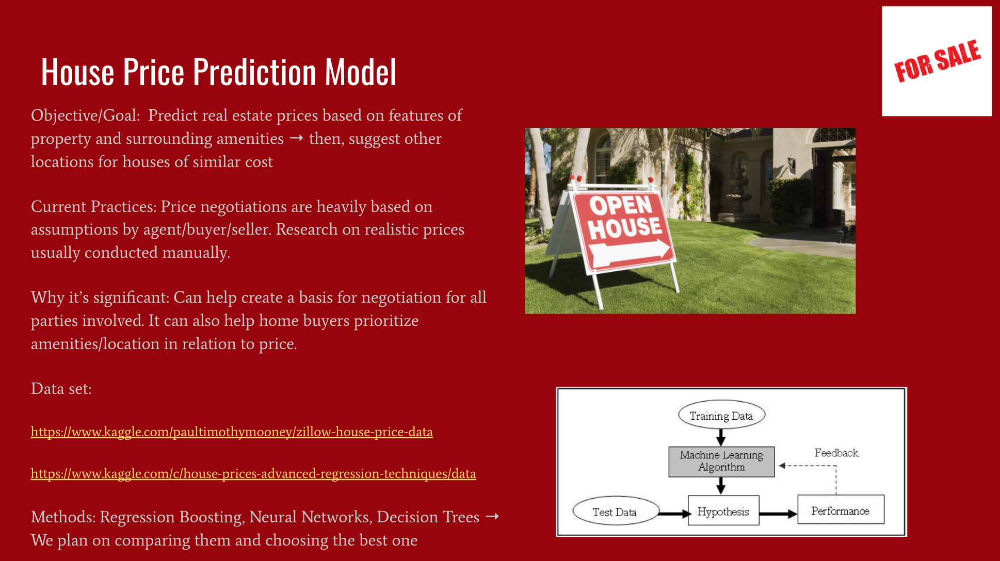

# MachineLearning4641B
Machine Learning House Price Prediction

  

# Background Information

Currently, real-estate agents and potential buyers have to research and gather information about the specific property (and its surroundings) before they can come up with a final judgement as to how much the price mark-up should be. They may also possibly consult an algorithm to assist them in this process of gathering the data and estimating prices. Thus, there is a lot of arbitrary actions taken in the process of predicting modern house prices. The new approach that we suggest is simply taking into account multiple different features and attributes all at once. We can then use this information along with a comprehensive overview provided by other known properties in order to provide real estate agents with an idea of how much a known property would cost. We could also provide potential buyers with an estimate of how much their very own dream home would cost. Real Estate agents would greatly benfit from our model because it would help make their lives a little easier if an algorithm is considering all possible features of properties and predicting the price of a known property while considering this information. Home buyers would also primarily benefit since this model would provide them with an accurate estimate of how much their dream home would cost them. In normal circumstances, buyers must consult architects and housing experts in order to get a rough estimate but our model does it all accurately and in a faster time. Our model will expediate this process and take a weight off the shoulders of the buyers by providing them with options.
# Methods Used

Supervised Methods: Regression Boosting, Neural Networks, Decision Trees → We plan on comparing them to choose the best
Unsupervised Methods: Kmeans Clustering  →  in order to find houses in other locations of similar prices

# Goal
Give buyers a model that they can use to make their future real estate decisions concerning how  they would like to obtain a house (ex. If buying is too expensive then rent). This way, buyers can be more equipped when negotiating the final price of a property they would like to buy. However, not only this, but we also provide house buyers with other recommended locations where houses of similar prices may be located. Thus, at the end of the day, we aim to provide potential house buyers with as many options as possible.

# Looking Forward
By the end of the project, we hope to have trained and tested a machine learning algorithm that takes in values for a set of features that relate to the internal and external characteristics of a property and is accurately able produce its value in US dollars. This value/price that is outputted should be assumed to be a good estimation for both a buyer, seller, and broker. In other words, we to be able to obtain a good base measure for negotiation during a sale. We think that this provide immense value as it is very common for the broker/seller in today’s market to immediately begin proceedings by highballing the price. This way, they end up selling at a solid price even after getting the price negotiated down by the buyer. Having an algorithm like to run against qualitative assumptions can help give perspective to all parties involved. 

Also note that another use case for this ML algorithm would be the increase in general education of factors that affect house prices. For example, someone who is moving to another part of the country can better understand the what variables affect real estate in his new home before even beginning looking for new houses in the area. Alternatively, an individual who is trying to break into the field as a realtor can use this algorithm to better educate himself on the maybe more imperceptible variables that play a role in dictating the price of a property (local amenities, neighborhood security, etc.).

# Links/Sources of Use
https://d1wqtxts1xzle7.cloudfront.net/48371730/b_3Areal.0000035309.60607.5320160827-6152-1gm7cle.pdf?1472359387=&response-content-disposition=inline%3B+filename%3DModeling_Spatial_and_Temporal_House_Pric.pdf&Expires=1601692659&Signature=JT7LYHtvea8TbHsytU1EjpMijeclefxw5h~yGob10BFaUk2TT9BhUMVfhixKB6RVzHkIjXxoG24D2Ra0KnxfDSn4-4H35Ud3~nSpImba~UNmT8aJZ6plzENUfQYeq6xBi1WLSNwaiL0iCLGwtzIJmvRdt2ejcpoPWzE3JpG4PSn5-yniauMWH9EwvIG47n7FEI3h8KJF~HU8PDXkLAnXToHQfb5L0dL7SZ3cDt8fD873Ft95VdzDO6ww2sUvahV0XTG~3MgvprVXuwbI2RbC865H1Ot5MGFK7kh-~FdS1xYVWpyHlJID30MigE2T62UZD5xHzBaY8Pf~QBw~y1IrkA__&Key-Pair-Id=APKAJLOHF5GGSLRBV4ZA

http://journal.dogus.edu.tr/index.php/duj/article/viewFile/80/95

https://ideas.repec.org/a/vaj/journl/v6y2011i1p58-105.html
