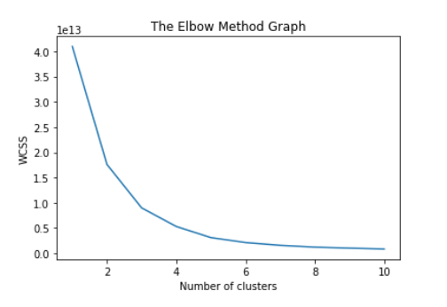

# MachineLearning4641B
Machine Learning House Price Prediction

  

# Background Information

Currently, real-estate agents and potential buyers have to research and gather information about the specific property (and its surroundings) before they can come up with a final judgement as to how much the price mark-up should be. They may also possibly consult an algorithm to assist them in this process of gathering the data and estimating prices. Thus, there is a lot of arbitrary actions taken in the process of predicting modern house prices. The new approach that we suggest is simply taking into account multiple different features and attributes all at once. We can then use this information along with a comprehensive overview provided by other known properties in order to provide real estate agents with an idea of how much a known property would cost. We could also provide potential buyers with an estimate of how much their very own dream home would cost. Real Estate agents would greatly benfit from our model because it would help make their lives a little easier if an algorithm is considering all possible features of properties and predicting the price of a known property while considering this information. Home buyers would also primarily benefit since this model would provide them with an accurate estimate of how much their dream home would cost them. In normal circumstances, buyers must consult architects and housing experts in order to get a rough estimate but our model does it all accurately and in a faster time. Our model will expediate this process and take a weight off the shoulders of the buyers by providing them with options.
# Methods Used

Supervised Methods: ADABoost XGB Regressors , Regression Boosting, Neural Networks, Decision Trees → We plan on comparing them to choose the best
Unsupervised Methods: Kmeans Clustering  →  in order to find houses in other locations of similar prices

# Goal
Give buyers a model that they can use to make their future real estate decisions concerning how  they would like to obtain a house (ex. If buying is too expensive then rent). This way, buyers can be more equipped when negotiating the final price of a property they would like to buy. However, not only this, but we also provide house buyers with other recommended locations where houses of similar prices may be located. Thus, at the end of the day, we aim to provide potential house buyers with as many options as possible.

# Looking Forward
By the end of the project, we hope to have trained and tested a machine learning algorithm that takes in values for a set of features that relate to the internal and external characteristics of a property and is accurately able produce its value in US dollars. This value/price that is outputted should be assumed to be a good estimation for both a buyer, seller, and broker. In other words, we to be able to obtain a good base measure for negotiation during a sale. We think that this provide immense value as it is very common for the broker/seller in today’s market to immediately begin proceedings by highballing the price. This way, they end up selling at a solid price even after getting the price negotiated down by the buyer. Having an algorithm like to run against qualitative assumptions can help give perspective to all parties involved. 

Also note that another use case for this ML algorithm would be the increase in general education of factors that affect house prices. For example, someone who is moving to another part of the country can better understand the what variables affect real estate in his new home before even beginning looking for new houses in the area. Alternatively, an individual who is trying to break into the field as a realtor can use this algorithm to better educate himself on the maybe more imperceptible variables that play a role in dictating the price of a property (local amenities, neighborhood security, etc.).

# Touchpoint 2 Report Update

Recap, our team is trying to predict real estate prices given features/attributes of a house. At our last touchpoint, we were using a dataset about pre-built houses. But as we continued to research more about the housing market, we quickly came to the conclusion that although pre-built houses have historically been very common (in ML models and in the real world), many people are currently buying manufactured houses. The latter option is much more affordable and futuristic of the two options. So we are now using a dataset by the US Census Bureau that is geared more towards the manufactures houses feature. 

With this dataset, we were first tasked with cleaning up the data. We did this by taking the different datasets provided by year and merging them together so that we had one collective dataset. From there we had to decide what to do with the null (NaN) values because those wouldn’t allow our models to run optimally. This is where we facced our biggest challenge.. We didn’t know what to replace these null values with. Initially, we replaced these values with a constant negative number (-1), however we noticed that sets with large numbers of null values, and hence large number of -1s, drastically skewed the data. Upon further research, however, we realized we could use a machine learning algorithm to fill in these values. Our solution was to use linear regression to predict these values in order to retrieve a more accurate dataset prediction. 

From here we are testing different Unsupervised Learning ML algorithms to see which yields the most accurate results. At first we ran K-means on cluster sizes 1 to 10 to and found the intertias of each of the clusters. Using this, we could extract the number of clusters we needed by utilizing the elbow method. Our graph looked like a 100 degree angle with the inertia quickly dropping to the elbow on the 2nd cluster. This was a warning sign that we noted. We then ran K-means on our data with 2 clusters and got a graph where the 2 clusters were on opposite sides of the graph. One cluster was divided between the top right and bottom left and the other cluster was near the bottom left. We noted that this was extraordinary too. Our final test on our data was running PCA and we received clusters that were stacked on top of each other which we found to be peculiar.This was a big roadblock for us and we couldn’t figure out what was wrong. After receiving feedback from our amazing TA, Gnanaguruparan Aishvaryaadevi, we figured out a solution. She informed us that we were getting these peculiarities because we were clustering on all features in our dataset when we should actually run clustering on the features that matter most. We quickly realized that the features that mattered the most are region and price. The reason that these two features matters the most was because the end goal was to potentially recommend other manufactured houses in specific locations to the customers or whoever used the model. If we could find a correlation between region and price, this task would become very easy. Hence, we dropped all columns in our dataset that weren’t region or price. We then ran K-means once again, but got a graph that came out strangely distributed into 5 stacks of clusters. So then with this  K-means, we ran PCA on the results so that we could reduce dimensionality down to two columns and retrieve a more accurate representation of our data. This, in turn, gave us workable results because it showed us that if additional relevant features were included, then efficient groupings could be formed. With this information and the help of our TA, we made the assertion that when we recommend other houses to the customers after we’ve predicted their price, we can choose out of the clusters created by the final PCA algorithm. We finally got favorable results! With this information, we can make the assertion that when we recommend other houses to the customers after we’ve predicted their price, we can choose out of the clusters created by the final PCA algorithm. 

We plan on exploring more of unsupervised learning and use GMM and a decision tree on the data and out of the 4 machine learning algorithms, we will pick the one that yields the best results. For next steps, once we are able to successfully decide on a final unsupervised learning model, we will then tackle the supervised learning aspect of our project, which makes up a bulk of the work, since the original goal of our project was to be able to predict house prices given features of a house. The supervised learning models that we plan on using will of course include regression and thus we will run models such as Decision Tree Regressors, Logistic Regression, and Neural Networks. Out of these, the ones that yield the best results will be included on our final supervised model.

The final result of the cleaned up data once all NaN value were predicted by linear regression:

  

Our execution of the elbow method to find the best possible # of clusters for K-means. This method helped in relation to K-means as it gave us a better idea of number of clusters to use.

  

Our final visual after only running K-means without including other features such as
Sqft and # of Bedrooms in addition to our previously shown Price and Region. This approach was somewhat  useful because although there was little differentiating factor between different price ranges in relation to different regions it for a select few of the price ranges it assists in actual region prediction.

  

Our final visual model after running K-means and reducing dimensionality with PCA with Sqft and # Bedrooms included. This approach was very useful as it visually showed us the bundled grouping we could use.

  

# Touchpoint 3 and Final Report Update
For our final touchpoint, we started testing different regression models on our data to see which will yield the most accurate results. Our first step was to split our data into training and testing data. We let the price act as the y label and all other labels served as the Xs. We also set 20 percent of our data as the testing data. From there our first model we wanted to fit on the data was a neural net regressor, specifically MLP Regressor. After fitting and running a prediction on the testing data, we got a R^2 result of 0.3424 and a mean squared log error of 0.1175. Clearly this was not accurate. We then ran a linear regression on our data and after fitting the training data and predicting the X testing data, we got an R^2 value of 0.5885 and a mean squared log error of 0.0613. Finally, we ran XGB Regression on our data. After fitting our training x and y data and predicting the testing X data, we got an R^2 value of 0.04351 and a mean squared log error of 0.06129.

After running these ML models we found that our accuracy in predicting the housing prices was not at all where we wanted it to be. If we were to take this model into the real world we would want our algorithm working as efficiently as possible in order to point customers in the right direction based on the house price range they were looking for. Thus we began to dive deep in working with different parameters. We implemented a DecisionTreeRegression model and instead of simply testing out different depths and split values to see which ones would yield the best results (which often proved to be very inefficient) we used cross validation to find the best suitable depth for the decision Tree. Once we had this depth specified along with other parameters such as max leaf nodes, we wanted to create our own way of calculating the error between the Testing values and the predicted values. We did this by specified a value which we found to be a little reasonable when dealing with predicting house prices. When we leave a leeway of about $20000 our decision tree regressor is able to get about 78% accuracy which we believe we can still get a bit higher in the coming week by employing bootstrapping. In other works we can take random variations of data, fit different decision trees to each variation, and then make an averaged prediction on each sub-sample. From the precalculations we have done we know that bootstrapping does indeed show some promise for a data set such as ours. We also saw that if we decrease our threshold to about $10000 which is very accurate when it comes to predicting house prices, we have an accuracy rate of 60%. However, we are decided to stick to a threshold of $20000 for now in order to reach as much accuracy as possible. Us also thresholding would also us to be more precise as well. If we were given more data then it is very possible that we could use similar supervised techniques as we have been using in order to potentially get into the 90s range.

By this point we had achieved somewhat of a correlation between the Location/Region of the manufactured houses in addition to their specified Prices. After attempting to use a dimensionality reduction approach in order to better our correlation and make it seem more apparent, we found that our most easily understandable and usable data mainly resulted from the comparison of our Region vs Prices columns within our cleaned up dataset. As a result, we decided that this specific relationship between the aforementioned two columns would be what we used once we had predicted the prices and simply had to point the customer in the direction of what regions he/she should look in, in order to find houses of a similar type and budget.

Once we had our correlation diagram finalized, it was then time to move on to the supervised learning aspect of our project. In our case, since we were aiming to predict house pricing to the best of our ability, we used all of the columns within our dataframe ["REGION", "SHIPMONTH","SECTIONS","WEIGHT", "STATUS", "SQFT", "BEDROOMS", "TITLED", "LOCATION", "FOUNDATION","SECURED"] (except for PRICES) as our X values and we used our ["PRICES"] column as our Y value. We then performed a 70 by 30 split so that we could separate 70% percent of our data into training data and the other 30% in testing data. Once the separations had been formed, it was time to get to work with which models we would look to implement. We started off simply guess checking many different regression models such as XGBRegression, Neural Networks , and Linear Regression in order to gain a better idea of what could work and what definitely wouldn't. To our dismay none of the models seemed to perform as we had hoped they would since the best accuracy we discovered was 57% given by our Linear Regression model. After trying a few more failed Models such as SVR we began to experiment much more with hyperparameter tuning and this opened new doors for us.The first checkpoint we reached was that by simply modifying the hyperparameters of a DecisionTreeRegressor (and slightly altering values such as the max_depth), we were able to bump up the accuracy  of predicted House Prices to nearly 76% within a range of $20000 of the original home price. Although this did seem some what reasonable to us, we aimed to decrease the range that we were predicting in as much as possible while increasing the percentage accuracy. In order to achieve this we decided to make use of ensembling and we employed the use of Bagging and Boosting. Bagging is a process by which the technique of random choice with replacement is employed in order to select features and reduce chances of overfitting. Boosting is similar, but is mainly used to set weights to features that may be overlooked so that all features can be considered when creating separate groupings. Nonetheless, after much research we found that both strategies are very common in increasing model accuracy. Thus, for bagging we used Random Forest (which did not seem to work too well for us as it only gave us a 76% accuracy and thus not much of an improvement) and for boosting we used ADABooster which worked wonders for our models. At first we passed our DecisionTreeRegressor into the ADABooster as a base function and this increased the accuracy of our model by about 1% within a $17000 of the actual prices. This showed us that some progress was being made in order to get us closer to achieving our goal. We then reused the XGBRegressor that we had used earlier, and after tuning its hyperparameters and number of estimators, we found that it actually worked a little better than our decision tree with respect to its predictive accuracy. Thus, we applied the ADABooster to our XGBRegressor and after fine tuning the ADABooster's estimators and the XGBRegressor's learning rate and max depth, we saw the accuracy rise to 80% within a $17000 range. 

Once we hit 80% accuracy we did indeed try to get it even higher. First we tried using feature selection in our approach. We decided to take columns that didn't seem as relevant as we thought them to be, out of our training data. However, doing so resulted in our accuracy results falling down to about 40% to 50%. Although this showed us that this approach would not work it also proved to us that there indeed was a correlation between the REGION/LOCATION of the manufactured house and its PRICE. Thus the results were supportive to our unsupervised learning portion of the project. Lastly we tried to clean the data in a way where all invalid data (which I originally) predicted values for using linear regression) would be taken out of the dataframe. This left us with little data
to work with which drove the accuracy prediction down once again. Thus in the end, we settle for the 80% accuracy within a $17000 price range of a house. Note that we’ve basically predicted within 17000 dollars of accuracy so our prices are within 17000 dollars of the original prices. This represents our precision range. 

We believe that our accuracy was reasonable given the amount of data and the amount of invalid entries we had to make up for in our columns. If a customer did want to find out the price of a specific manufactured house given its features, not only would we be able to give him/her an actual prediction of the price they would be looking at, but we would also be able to show the customer protantial other areas in which they can look houses given the correlation diagram that we finalized in our data.We set out to make house price predicting more easy and we believe that although we hit a fair amount of roadblocks we did come out with a well built model that performs well given valid input.

Our Initial attempt using our DecisionTreeRegression Model to predict house prices within a precision range of $20000 yielded the following results (as you can see, the second graph has some fluctuation which represents the precision range):

  

Our Final attempt using our ADABooster combined with the XGBooster Model to predict house prices within a precision range of a more concise $17000 yielded the following results (as you can see, the second graph has some less fluctuation than the one above which represents the modified precision range -- the line is also more centered showing improved accuracy):

  

Region vs Price Final Correlation

  

# Links/Sources of Use
https://d1wqtxts1xzle7.cloudfront.net/48371730/b_3Areal.0000035309.60607.5320160827-6152-1gm7cle.pdf?1472359387=&response-content-disposition=inline%3B+filename%3DModeling_Spatial_and_Temporal_House_Pric.pdf&Expires=1601692659&Signature=JT7LYHtvea8TbHsytU1EjpMijeclefxw5h~yGob10BFaUk2TT9BhUMVfhixKB6RVzHkIjXxoG24D2Ra0KnxfDSn4-4H35Ud3~nSpImba~UNmT8aJZ6plzENUfQYeq6xBi1WLSNwaiL0iCLGwtzIJmvRdt2ejcpoPWzE3JpG4PSn5-yniauMWH9EwvIG47n7FEI3h8KJF~HU8PDXkLAnXToHQfb5L0dL7SZ3cDt8fD873Ft95VdzDO6ww2sUvahV0XTG~3MgvprVXuwbI2RbC865H1Ot5MGFK7kh-~FdS1xYVWpyHlJID30MigE2T62UZD5xHzBaY8Pf~QBw~y1IrkA__&Key-Pair-Id=APKAJLOHF5GGSLRBV4ZA

http://journal.dogus.edu.tr/index.php/duj/article/viewFile/80/95

https://ideas.repec.org/a/vaj/journl/v6y2011i1p58-105.html
